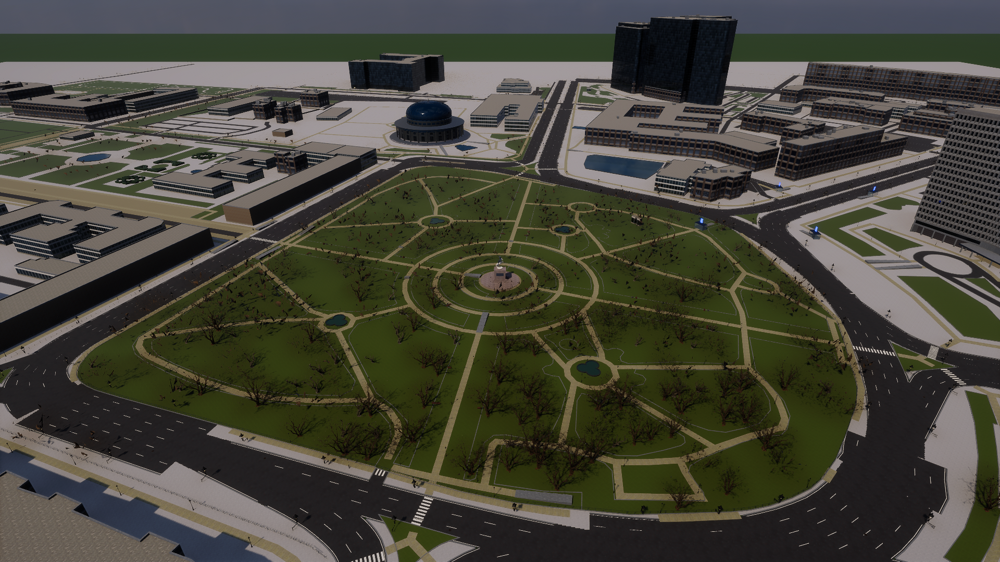
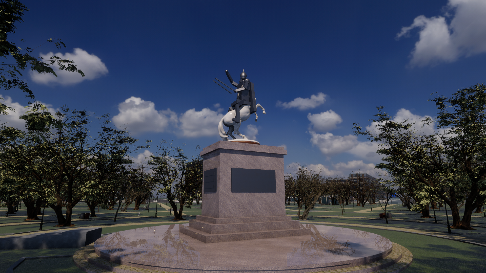

# Amir Temur Square — Tashkent (Unity 6 HDRP)

A realistic, walkable 3D recreation of Amir Temur Square in Tashkent, generated from real
OpenStreetMap geometry and CC0 assets, rendered with Unity 6.3 HDRP (high-fidelity tier:
screen-space GI, SSR, volumetric fog, HDRI sky, contact shadows, TAA).

## Play
Download the Windows build (see Releases) and run `AmirTemurSquare.exe`. Requirements: Windows 10/11 x64,
a DX12/DX11 GPU with 4 GB+ VRAM (GTX 1060 / RX 580 class or better), 8 GB RAM.

| Input | Action |
|---|---|
| W A S D / left stick | move (soft push = walk, full push = jog) |
| Shift / L3 | sprint |
| Space / A | jump |
| Mouse / right stick | orbit camera |
| 1 2 3 4 | time of day 08:00 / 13:00 / 18:30 / 22:00 |
| F3 | FPS + speed readout |
| Esc | release cursor |

## Regenerate from source
1. Unity 6000.3.x with the HDRP template packages (see `AmirTemurSquare/Packages/manifest.json`).
2. `python data/download_assets.py` then `python data/process_assets.py` (pip: pillow numpy) — fetches the
   CC0 Poly Haven models/HDRIs, ambientCG PBR textures and Unity's mocap character set into
   `AmirTemurSquare/Assets/AmirTemur/Art/` (binaries are git-ignored; their `.meta` files are versioned).
3. `python data/preprocess_osm.py` rebuilds `data/city.json` from `data/osm_square.json` (Overpass export).
4. Run `Unity.exe -batchmode -quit -projectPath AmirTemurSquare -executeMethod AmirTemur.Editor.BuildAll.Run`
   (generates materials, prefabs, HDRP scene, city, landmarks, player, screenshots), then
   `-executeMethod AmirTemur.Editor.BuildAll.BuildPlayer` for the Windows build.

## Layout
- `AmirTemurSquare/Assets/AmirTemur/Editor` — generators: `Shared/` (mesh, materials, data), `City/` (OSM roads,
  paths, lawns, fountains, buildings, props, street lights), `Landmarks/` (monument, Hotel Uzbekistan, Forum Palace,
  Timurid Museum, Chimes), `Character/` (humanoid import, animator, Cinemachine rig), `Pipeline/` (asset import,
  HDRP scene setup, screenshots, build).
- `AmirTemurSquare/Assets/AmirTemur/Runtime` — third-person controller (root motion), HUD, day/night cycle.
- `data/` — OSM download/preprocessing and asset pipeline scripts.
- `docs/ARCHITECTURE.md` — conventions.

## Licences
Code: MIT. Map data © OpenStreetMap contributors (ODbL). Textures/models/HDRIs: CC0 (ambientCG, Poly Haven).
Character and animations: Unity Standard Assets Characters (Unity Companion License).
